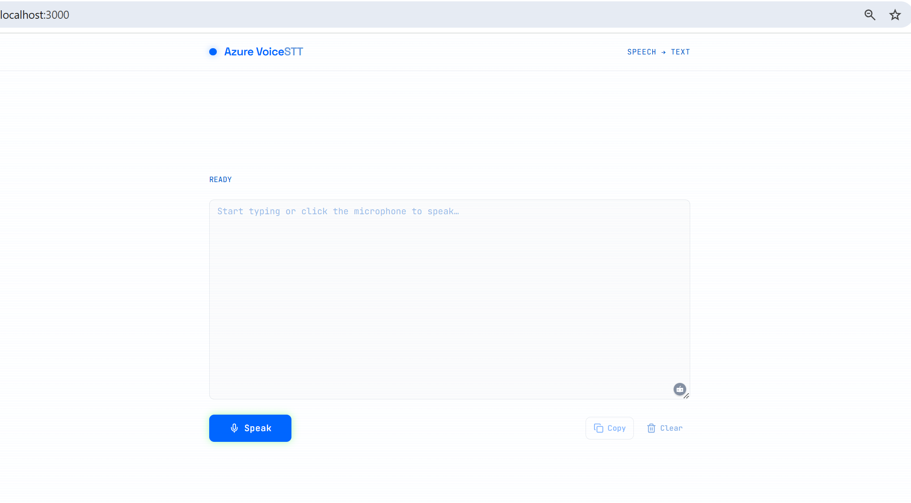

# Azure Voice STT with Next JS

Talk into your mic, get text on screen. Simple as that.

This is a Next.js 16 app that turns speech into text using Azure's Azure Cognitive Services Speech SDK . I built it with a clean white + blue theme and kept things minimal so you can focus on what matters.


---

## What You Get

- Type or talk  your choice
- See words appear as you speak (real-time transcription)
- One-click copy and clear buttons
- Clean, distraction-free interface

---

## Before You Start

You'll need three things:

1. **Node.js** (v18.17+)   [grab it here](https://nodejs.org/)
2. **An Azure account**   [free tier works fine](https://azure.microsoft.com/free/)
3. **Azure AI Foundry resource** with Live Voice enabled

---

## Getting Started

**Step 1: Clone and install**

```bash
git clone <your-repo-url>
cd azure-stt-app-nextjs
npm install
```

**Step 2: Add your Azure credentials**

Make a copy of the example env file:

```bash
cp .env.local.example .env.local
```

Open `.env.local` and add your keys:

```env
NEXT_PUBLIC_AZURE_ENDPOINT=https://your-resource.cognitiveservices.azure.com
NEXT_PUBLIC_AZURE_API_KEY=your-api-key-here
```

Not sure where to find these? Head to [Azure Portal](https://portal.azure.com), open your AI Foundry resource, and look under "Keys and Endpoint".

**Step 3: Fire it up**

```bash
npm run dev
```

Go to [http://localhost:3000](http://localhost:3000) and you're good to go.

---

## How to Use It

1. Hit the **Speak** button
2. Allow mic access when your browser asks
3. Start talking — text shows up as you go
4. Click **Stop** when you're done
5. Edit the text if needed, then **Copy** or **Clear**

That's it. No complicated setup, no learning curve.

---

## Folder Layout

```
├── app/
│   ├── globals.css          # styles
│   ├── layout.tsx           # root layout
│   └── page.tsx             # main page with editor
├── components/ui/
│   ├── button.tsx
│   └── textarea.tsx
├── lib/
│   ├── use-voicelive-stt.ts # the magic happens here
│   └── utils.ts
├── .env.local.example
├── tailwind.config.ts
└── package.json
```

---

## Under the Hood

The speech recognition runs through a custom React hook that handles all the Azure stuff:

- Opens a connection to VoiceLive using your API key
- Grabs audio from your mic at 24kHz
- Converts it to the right format and streams it over
- Picks up transcriptions as they come back
- Drops the text into the editor

The hook uses Azure Cognitive Services Speech SDK.

**Want to see what's happening?** Open browser DevTools (F12) and check the console. Look for lines that start with `[STT]` — they'll show you every event from connection to transcription.

---

## Going Live

```bash
npm run build
npm start
```

**Heads up:** This demo exposes your API key in the browser (that's the `NEXT_PUBLIC_` prefix). Fine for testing, but for a real production app you'll want to route requests through a backend so your keys stay private.

---

## Something Not Working?

**Mic permission denied?**  
Check your browser settings. Make sure localhost can use your microphone.

**"Missing NEXT_PUBLIC_AZURE_ENDPOINT" error?**  
Double-check that `.env.local` exists and has the right values. Restart the dev server after making changes.

**Connection failing?**  
Make sure your Azure endpoint is correct and VoiceLive is enabled on your resource.

**Mic is on but nothing's transcribing?**  
Open DevTools and watch for `[STT]` logs. You should see "Speech started" when you talk. If you see that but no transcription, make sure you've deployed the `gpt-4o-mini-realtime-preview` model in your Azure resource.

**No "Speech started" showing at all?**  
Your audio might not be reaching the service. Check that nothing else is using your mic, try Chrome if you're on a different browser, and make sure you're not muted.

---

## Built With

- Next.js 16
- Azure Cognitive Services Speech SDK
- shadcn/ui components
- Tailwind CSS
- TypeScript

---

## License

MIT — do whatever you want with it.
